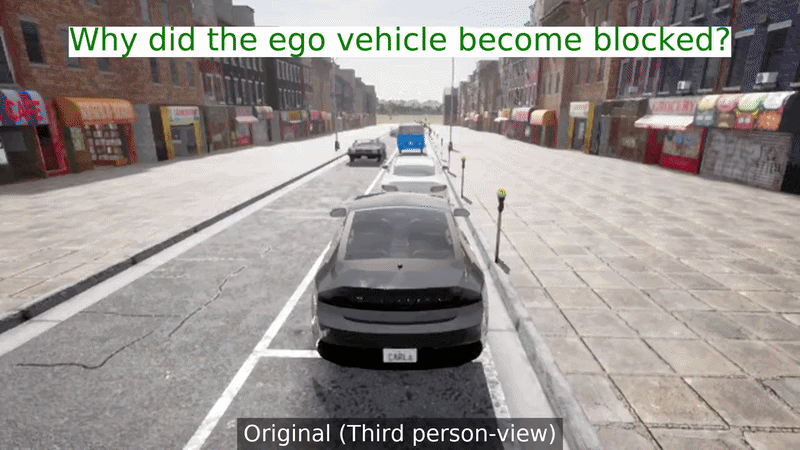

# From Driving Videos to Simulatable Scenarios

*D-V2S: Driving Video to Scenario*

**[ITSC 2026]** | [Project Page](https://alexandre-levy.github.io/DV2S.github.io/) | Paper (coming soon)

---

## Authors

- [Alexandre Levy](https://scholar.google.com/citations?user=Um9rfMwAAAAJ&hl=en)<sup>1,2</sup>
- [Ernest Valveny Llobet](https://scholar.google.com/citations?user=ChmX8ogAAAAJ&hl=en)<sup>1,2</sup>
- [Antonio Manuel Lopez Peña](https://scholar.google.com/citations?user=3LYW1zMAAAAJ&hl=es)<sup>1,2</sup>

<sup>1</sup>Computer Vision Centre (CVC) &nbsp; <sup>2</sup>Dept. Computer Science, Universitat Autònoma de Barcelona (UAB)

---

## Abstract

Autonomous vehicles (AVs) face driving scenarios ranging from routine traffic to rare events. To assess safety it is crucial to reproduce these scenarios in a controllable, repeatable, and scalable manner, with simulation playing a key role. This paper introduces D-V2S, a novel framework that automatically generates simulatable driving scenarios from driving videos. D-V2S operates in two stages: a Driving Record Analyzer (DRA) uses a vision language model (VLM) with our designed prompt to produce natural-language descriptions from input videos, capturing road layouts and dynamic traffic interactions; subsequently, a Scenario Generator (SG) uses a large language model (LLM) and our conditioning context to translate these descriptions into executable scenarios. Using simulations, we show that D-V2S generates scenarios where 90% of the relevant semantic elements of the videos are present. We also provide qualitative results demonstrating D-V2S's capability to transform real-world driving videos into simulatable scenarios. Moreover, we provide both semantic and human driven ablative analyses of D-V2S's modules. In particular, we show how the VLM choice matters for DRA, and how our SG achieves a 75% preference rate over other state-of-the-art methods.

<p align="center">
  
</p>

---

<p align="center">
  
</p>

---

## Code

D-V2S turns a driving video into an executable [Scenic](https://scenic-lang.readthedocs.io/)
scenario for the CARLA simulator, through the two stages described above:

```
video.mp4 ──[DRA: VLM]──> natural-language description ──[SG: LLM]──> scenario.scenic
```

### Repository layout

```
scripts/
  dra.py          Stage 1 only: video + question -> text description
  sg.py           Stage 2 only: text description -> Scenic script
  dra_sg.py       Full pipeline: video -> description -> Scenic script

prompts/                       Assets used to build the scenario-generation prompt
  rules.txt                    Scenic authoring constraints (what not to do / how to do it)
  rules_pro.txt                Same rules, reorganized into titled sections
  examples/*.scenic            Worked (description -> Scenic code) examples
  examples_manifest.txt        Order in which the example files are assembled into the prompt
  template.txt                 Closing instructions + Scenic skeleton with the
                                ***DESCRIPTION_TO_REPLACE*** placeholder

examples/                      Sample input videos referenced by the *_examples.txt files
  DRA/                         Sample clips for scripts/dra.py
  BERTHA/                      Sample clips for scripts/dra_sg.py

dra_examples.txt                Input for scripts/dra.py   (video path / question pairs)
dra_sg_examples.txt             Input for scripts/dra_sg.py (one video path per line)
sg_examples.txt                 Input for scripts/sg.py     (one description per line)

results_scenic/                 Generated .scenic files (and matching .txt descriptions)
requirements.txt                Python dependencies for scripts/

LLaVA-NeXT/                     Vendored, locally modified checkout of LLaVA-NeXT (video-LLM
                                 DRA baseline; see its own dra.py and README.md)
Qwen-VL/                        Vendored, locally modified checkout of Qwen-VL (VLM DRA
                                 baseline; see its own dra.py and README.md)
Survey-DRA/                     Analysis scripts + raw responses for the human evaluation
                                 survey of DRA (video-description) quality
Survey-Scenario-generation/     Gradio app (deployed as a Hugging Face Space) used for the
                                 human evaluation survey of generated scenarios
```

`LLaVA-NeXT/` and `Qwen-VL/` are included as self-contained, locally modified checkouts of the
upstream projects (each keeps its own `README.md` and `LICENSE`) — they were used as
video-LLM / VLM baselines for the DRA stage and are independent of `scripts/`.

### Setup

```bash
pip install -r requirements.txt
export OPENAI_API_KEY=sk-...
```

All three scripts read `OPENAI_API_KEY` from the environment and resolve their input/prompt
paths relative to the current working directory, so run them **from the repository root**.

### Usage

#### Stage 1 only — describe videos (`scripts/dra.py`)

Reads `dra_examples.txt`: every pair of lines is a video path followed by the question to ask
about it. Writes every `(video, question, answer)` triple to `dra_file_results.txt`.

```bash
python scripts/dra.py
```

#### Stage 2 only — generate Scenic from a description (`scripts/sg.py`)

Reads `sg_examples.txt`: one free-text scenario description per line. For each line, builds
the full prompt from `prompts/` (rules + examples + template), calls GPT-4o, and writes
`results_scenic/scenario_%02d.scenic`.

```bash
python scripts/sg.py
```

#### Full pipeline — video to Scenic (`scripts/dra_sg.py`)

Reads `dra_sg_examples.txt`: one video path per line. For each video, samples frames, asks
GPT for a driving-scene description, then feeds that description into the same
`prompts/`-based Scenic generation step as `sg.py`. Writes, per video,
`results_scenic/<video_name>.txt` (description) and `results_scenic/<video_name>.scenic` (code).

```bash
python scripts/dra_sg.py
```

### Customizing the Scenic prompt

`prompts/rules.txt` and `prompts/examples/*.scenic` encode what the scenario generator is and
isn't allowed to do in Scenic. To extend the example set, drop a new `.scenic` file into
`prompts/examples/` with a `# Description: ...` header line followed by a blank line and the
code, then add its filename to `prompts/examples_manifest.txt`.

---

## Citation

```bibtex
@inproceedings{levy2026dv2s,
  title     = {From Driving Videos to Simulatable Scenarios},
  author    = {Levy, Alexandre and Valveny Llobet, Ernest and López, Antonio M.},
  booktitle = {Intelligent Transportation Systems Conference (ITSC)},
  year      = {2026}
}
```

## License

This project is licensed under the MIT License — see [LICENSE](LICENSE) for details.
